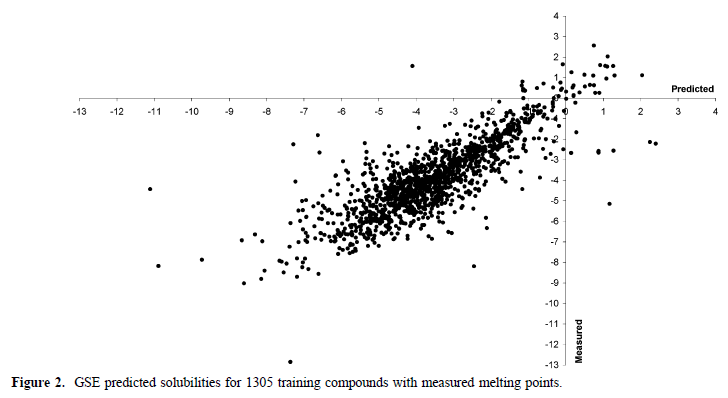
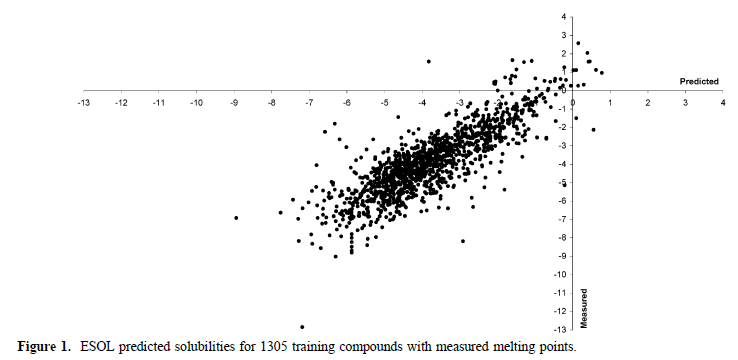
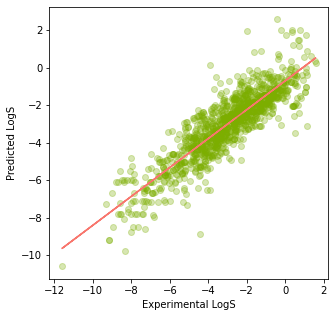

# Molecular Solubility Prediction App

This app predicts the Solubility **(LogS)** values of molecules!

## Literature Review

[ESOL: Estimating Aqueous Solubility Directly from Molecular Structure](https://pubs.acs.org/doi/10.1021/ci034243x). _J. Chem. Inf. Comput. Sci._ 2004, 44, 3, 1000-1005.

## Description

In the field of drug discovery, the solubility of the target molecule is a crucial parameter. Various factors influence this solubility - logpoctanol, molecular weight, the proportion of heavy atoms in aromatic systems, number of rotatable bonds, etc.
A wide range of models has been proposed to date to predict molecular solubility, among which **GSE** (**G**eneral **S**olubility **E**quation) is one of the most robust and effective ones, which measures the **LogP** and melting point **(Tm)** to predict the solubility **(LogS)**.

---

## 

As a limitation, GSE cannot predict the solubility of a molecule if the Tm is unknown. For that reason, a new model has been developed - **E**stimated **Sol**ubility or **ESOL**.In this model, four parameters are used to predict the LogS - **cLogP**, Molecular Weight (**MWT**), Rotatable Bonds (**RB**), and Aromatic Proportion (**AP**).

---

## 

---

- First of all, dataset is collected from [here](https://raw.githubusercontent.com/dataprofessor/data/master/delaney_solubility_with_descriptors.csv), containing **MolLogP**, **MolWt**, **NumRotatableBonds**, **AromaticProportion** and finally **logS** columns.
- Next, **logS** column is dropped and assigned as the `target`.
  **Linear Regression Model** is used for the prediction, and model performance is checked.
- Next, model equataion is created, containing the five parameters.
- Next, Experimental vs Predicted logS values are plotted.

---

## 

---
